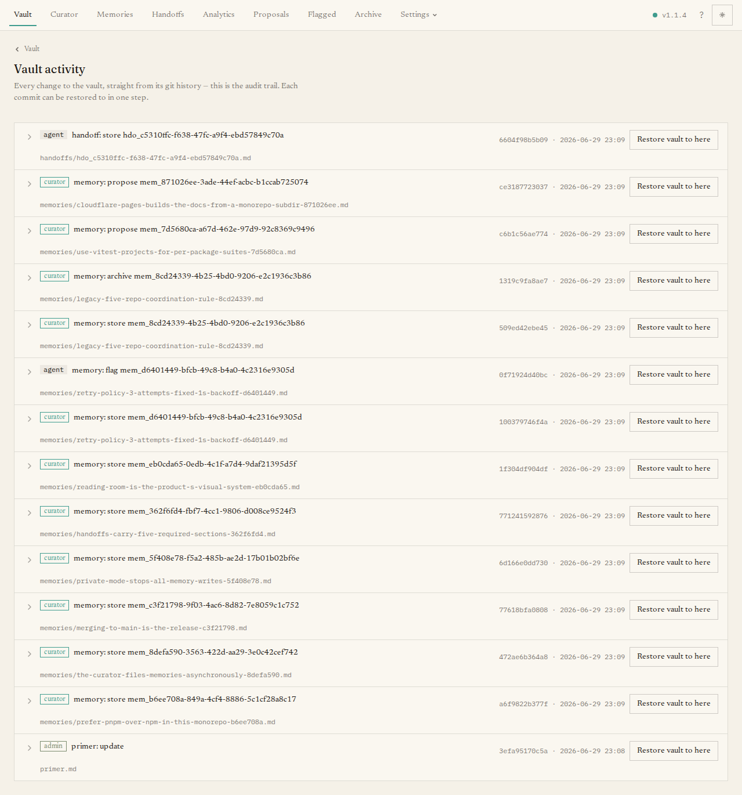

Every change to The Librarian — by an agent, the curator, or you — is recorded as a
commit in the vault's Git history. The **Activity** page shows that history as a
readable feed, so it doubles as your audit trail and your undo button of last
resort.

## What you'll see

A feed of changes, newest first. Each entry shows a short description of the change,
who or what made it (an agent, the curator, an admin, or the system), and when.
Expand an entry to load the per-file differences for that change, each tagged as
added, modified, deleted, or renamed.

## The main task

Most of the time you are just reading — confirming the curator did what you
expected, or seeing what an agent wrote.

When you need it, each entry also has a **Restore vault to here** button that rolls
the *entire* vault back to that point. Because this is a sweeping, destructive
change, it asks you to type a confirmation phrase before it proceeds. For everyday
"undo one file" you usually want the [Vault](/dashboard/vault/) page's per-file
history instead; this whole-vault restore is for recovering from a bad batch.

If the vault has no commits yet, the page reads **No vault commits yet**.

## Refused attempts (admin API)

The Git activity feed remains the success trail: only changes that produced commits appear
there. The server separately records authentication, authorization, rate-limit, credential,
and shelf-routing refusals in a bounded, secret-free sidecar. Administrators can read that
newest-first evidence through `activity.refusals`; there is no dashboard view for it yet.
When an actor-display provider is installed, the response adds names only for actor ids on
the returned page, while the stable ids remain in each strict row.

The refusal log is on by default in the HTTP server process. Set
`LIBRARIAN_REFUSAL_LOG=false` to disable it. It retains at most two 5 MB generations, rate
limits writes to a 120-row burst and two rows per second, bounds queued disk work, and reports
counted drops. A read or orderly shutdown flushes the last finite drop burst. Stdio, CLI,
dashboard-local OAuth allowlist denials, dashboard-local credentials throttling, and reads
are not recorded. See the
[extension reference](/extend/extension-api/#refusal-evidence-spec-071) for the record,
query, redaction, and retention contracts.
