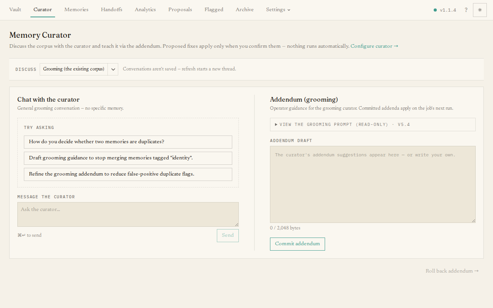

The **Curator** page is where you talk to the resident curator and, over time,
teach it to file and tidy your memories the way you want. It is a conversation
workspace, not a settings form — you discuss the collection, and the curator can
*propose* changes that only take effect when you confirm them.

## What you'll see

- A **job picker** at the top to choose which of the curator's two jobs you are
  working on — **Intake** (filing new submissions) or **Grooming** (tidying the
  existing collection).
- A **chat panel** where you type a message and read the curator's reply.
- An **addendum panel** showing that job's **guidance** — extra, plain-English
  instructions appended to the curator's standing prompt — as an editable draft.

The curator can **search your collection mid-conversation** (the same hybrid
recall your agents use), so asking it to "find other memories about X and merge
them into one document" works: it looks the memories up, then proposes the merge
for you to confirm. It searches up to three times per reply.

Conversations here are not saved; refreshing starts a new thread. The guidance you
commit, however, is kept.

## The main task: teach the curator

The guidance (its "addendum") is how you shape the curator's judgement — for
example, "prefer to merge near-duplicate deployment notes" or "keep security facts
verbatim". To change it:

- Edit the draft and press **Commit addendum**. The change is committed and the
  curator's **next run uses it immediately** — there is no restart.
- If an edit turns out badly, **Roll back addendum** restores the previous version.

Because the guidance is advisory, it can shape the curator's choices but never
override its built-in safety rules — those are re-checked on every operation no
matter what the guidance says, and a runaway addendum is capped in size. So you can
experiment freely.

For provider and scheduling settings (which model the curator uses, and when it
runs), see [Settings → Curator](/dashboard/settings/#curator) and the guide
[Configuring the curator](/guides/configuring-the-curator/).
