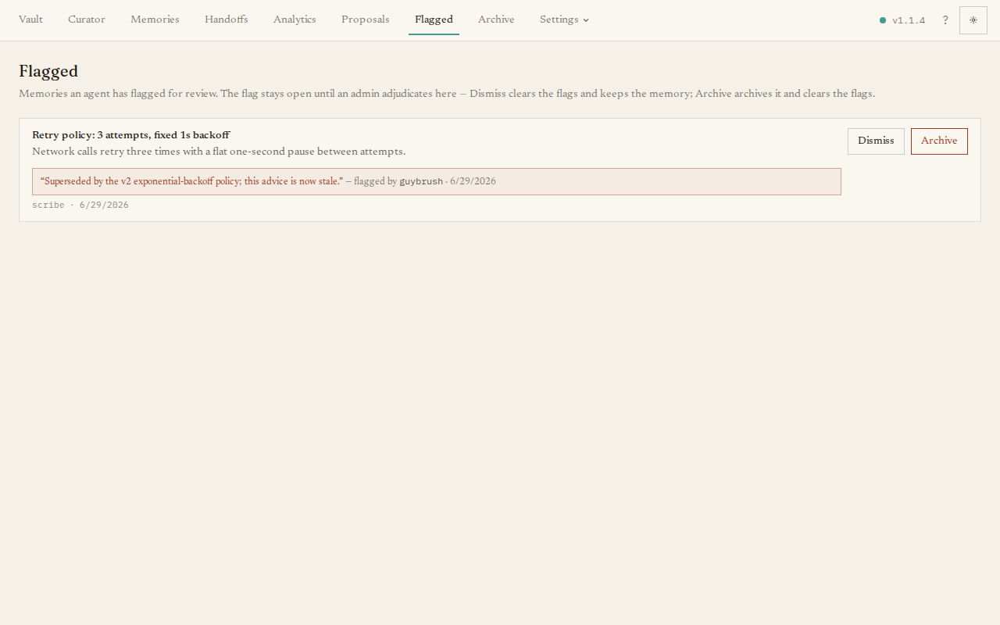

When an agent recalls a memory that looks wrong, it can **flag** it with a reason
rather than deleting it on its own. The **Flagged** page collects those reports so
you can decide what to do. Flagging also quietly demotes the memory in recall until
you have looked, so a suspect fact stops spreading while it waits.

## What you'll see

A read-only list of flagged memories. For each one you see the memory's title and
text, which agent it belongs to, and the **flag details** — the reason given, which
agent raised it, and when. A flag stays open until you act on it.

## The main task

Each flagged memory gives you two choices:

- **Dismiss** — the flag was unfounded; clear it and keep the memory active.
- **Archive** — the memory really is wrong or stale; archive it and clear the flag.

If nothing is flagged, the page reads **No flagged memories**.
