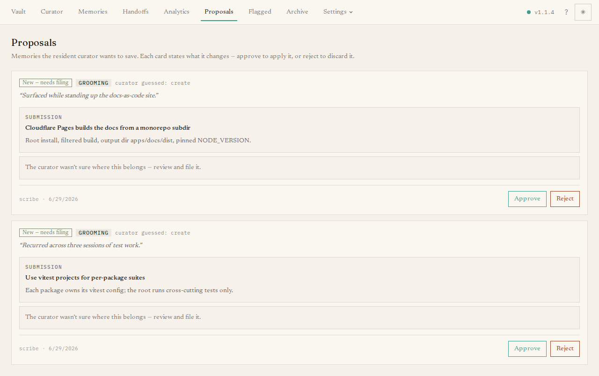

The **Proposals** page is the curator's in-tray to you. The curator handles
routine filing automatically, but anything that would **destroy or restructure** a
memory — archiving it, splitting it, or any change to a memory marked as needing
approval — is held back here for a human to decide. This is the page you will visit
most.

## What you'll see

Each proposal is a card describing one change the curator wants to make. A card
shows:

- a **badge** naming the action — *Update*, *Replace*, *Merge*, *Split*, or *New*;
- a **source** chip saying whether it came from **intake** (filing a new
  submission) or **grooming** (tidying the existing collection);
- the curator's **reasoning** for the change; and
- the **before and after** — for a simple edit, the old text, a diff, and the new
  text side by side; for a merge, the several sources and the merged result; for a
  split, the original and its replacements.

### The curator's plan

When an intake submission lands in the queue below the auto-apply confidence bar,
the card also shows the **curator's plan** — exactly what it wanted to do:

- *"Wanted to **augment** ‹Elaine› with: …"* — with a preview diff of the target
  memory as it would look **if the plan were applied**;
- *"Wanted to **replace** ‹Coffee› with: …"* — with the old → planned diff;
- *"Wanted to **file a new memory**:"* — with the curated title, body, and tags.

The judgment's **confidence** appears beneath the plan. If the memory the plan
points at has since been archived or deleted, the panel says so instead of
showing a preview.

## Resolving a proposal

The buttons on a card depend on what the curator planned:

- **Approve as augment of ‹X›** / **Approve — replaces ‹X›** — execute the plan
  exactly as previewed: the target memory is updated and the proposal leaves the
  queue. If the target has drifted or disappeared since the judgment, the button
  is disabled with the reason and nothing is touched.
- **Approve curated version** / **Approve raw submission** — for a planned new
  memory: activate the curator's cleaned-up title/body/tags, or the submission
  exactly as it arrived.
- **Approve** — on a plan-less card (grooming proposals, older proposals), the
  label spells out the consequence (*Approve — replaces 1 memory*, *Approve —
  merges 3 memories*, and so on).
- **Discuss this proposal** — open the [curator chat](/dashboard/curator/)
  grounded in this proposal, its plan, and its target. Ask why, or steer it to a
  different action; confirming a chat-proposed fix also clears the proposal from
  the queue.
- **Reject & make an example** — on intake proposals: reject it *and* teach the
  curator not to extract things like it again. See
  [Reviewing & accepting proposals](/guides/reviewing-proposals/#teaching-the-curator-from-what-you-see).
- **Reject** — discards the suggestion silently and leaves things as they were.

For a split that produces several new memories, an **Archive original** button
appears below the replacements so you can retire the source in one click once you
are happy with the pieces.

When the queue is empty it simply says **No proposals pending** — that is the goal
state.

For a step-by-step walkthrough of how to judge a proposal, see
[Reviewing & accepting proposals](/guides/reviewing-proposals/).
