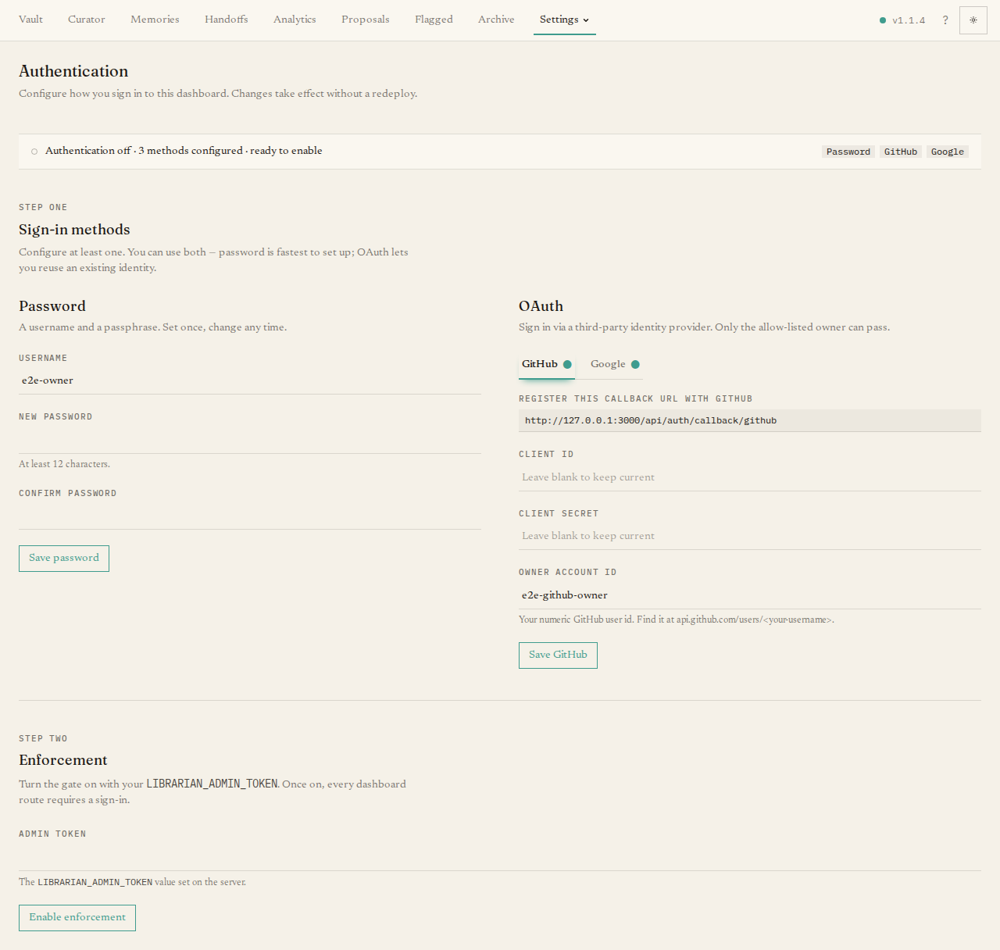

The **Settings** menu (top right of the dashboard) gathers everything you configure
once and rarely touch again. This page walks through each area. The menu lists them
as **Dashboard, Auth, Primer, Curator, Tokens, Connect, Captures,** and
**Backups**.

## Auth

**Settings → Auth** controls whether the dashboard requires you to sign in. It is
off by default and strongly recommended for any deployment reachable from the
internet. A status strip shows the current state and which sign-in methods are set
up.

Setting it up is two steps. **First, add at least one sign-in method** — a username
and password, and/or GitHub or Google login (the page shows the exact callback URL
to register for each). **Then turn enforcement on.** Once enabled, every dashboard
page asks an unrecognised visitor to sign in, and the change takes effect
immediately with no redeploy. If you ever lock yourself out, you can recover from
the server's command line — see
[Authentication & secrets](/deploy-and-operate/auth-and-secrets/).

## Primer

**Settings → Primer** is a single editor for the **briefing** every agent loads at
the start of a session (the file `vault/primer.md`). It teaches your agents the
core habits — recall before answering, remember durable facts, the handoff and
private-mode rules. Edit it and **Save**; the server enforces a 2 KB limit so it
stays short, and every save is tracked in history. Keep it generic guidance — never
put secrets or person-specific detail in it, because it is served to agents and is
readable without a token.

## Curator

**Settings → Curator** is where you configure the curator's language model and when
it runs. At the top you manage **LLM providers** — add a provider (such as
Anthropic or OpenAI) with its credentials, **test** the connection, and edit or
remove it. Below that are two tabs, **Intake** and **Grooming**, one per curator
job. In each you can turn the job on or off, set how often it runs, pick the model,
and see a table of recent runs with a **Run now** button to trigger one on demand.

For the bigger picture — what the two jobs do and how to tune them — see
[Configuring the curator](/guides/configuring-the-curator/).

## Tokens

**Settings → Tokens** manages the **agent tokens** your tools use to authenticate.
Generate a token with a label; its secret value is shown **once**, so copy it into
your tool's config right away. The table of active tokens lets you **revoke** any of
them, which takes effect immediately. Minting a token per agent (rather than sharing
one) is the recommended approach — it lets you attribute and revoke per tool.

## Connect

**Settings → Connect** helps you feed The Librarian from places other than a coding
agent — a **browser extension**, an **iPhone/iPad Shortcut**, and an **Android**
recipe — so you can clip an article or page into your references from anywhere. It
walks you through installing each, mints the **capture token** they need (shown
once), and shows the server URL to paste in. A table lists the capture tokens you
have issued, each with a **Revoke** button.

## Captures

**Settings → Captures** is a read-only log of those clip-from-a-device attempts. It
shows recent captures with their time, source URL, and status; successful ones link
to the reference that was filed, and failed ones show a (redacted) error and the
source so you can try again by hand. It also flags how many recent captures failed.

## Backups

**Settings → Backups** drives backing up your vault to a private GitHub repository.
A health strip shows when the last backup succeeded (or the error if it failed). You
configure the target repository and its credentials, can **Backup now** on demand,
and see a short history of recent backups. A **restore** section explains how to
pull the latest backup back in. Backups and restores are walked through end-to-end
in [Backups & restore](/guides/backups-restore/).

## Dashboard

**Settings → Dashboard** holds instance-level options — currently **server
auto-update**. Turn it on, choose a cadence (daily, weekly, or monthly), and the
server keeps itself up to date; the page also shows the current version, the latest
available, and when it last ran.
