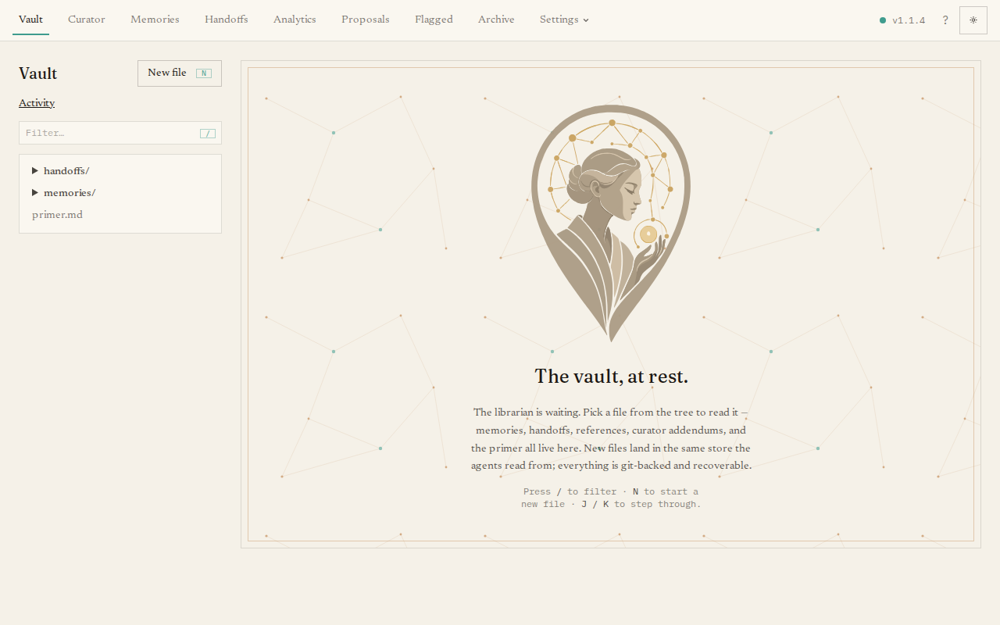

The **Vault** page is a file explorer for everything The Librarian stores — every
memory, handoff, reference, the curator's guidance files, and the agent briefing —
as the plain Markdown files they really are. It is the dashboard's home page, and
it works a lot like the note-taking app Obsidian, so you never need to touch Git or
a separate editor.

## What you'll see

A split view: a file **tree** on the left, and whatever file you select on the
right. The tree groups the vault into memories, handoffs, references, the curator's
addendums, and `primer.md`; type in the filter box to find a file fast.

The right-hand pane has three tabs:

- **Read** — the rendered Markdown, with clickable `[[wikilinks]]` between notes, a
  table of the file's properties, and a **backlinks** pane showing what links back
  to it.
- **Edit** — a raw editor. **Save** commits your change; the frontmatter is
  validated first, so you cannot save a malformed note.
- **History** — every past version of this file, with diffs, and a **Restore**
  button that brings back an earlier version as a fresh commit (history is never
  rewritten).

## The main tasks

- **Create** a file with **New file** (a dialog with a folder picker).
- **Move or rename** a file, or **Delete** it, from the file header.
- **Edit and save** in the Edit tab — every save is recorded in Git.
- **Roll back** a single file from its History tab.

Keyboard shortcuts speed this up: `N` new file, `J` / `K` to move between files,
`/` to filter, `E` to edit, `D` to delete.

Everything you do here is a tracked change. To see the whole vault's change history
in one place — and to roll the **entire** vault back to a point in time — use the
[Activity](/dashboard/activity/) view.
